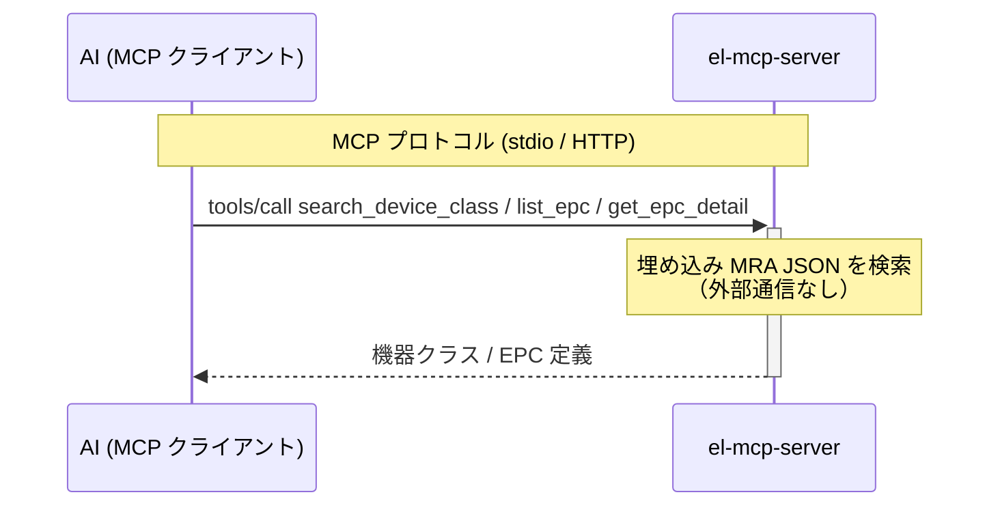
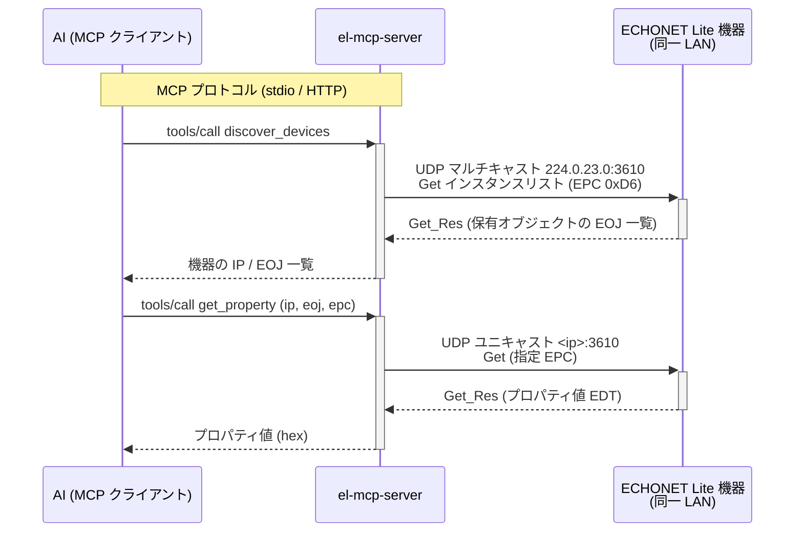
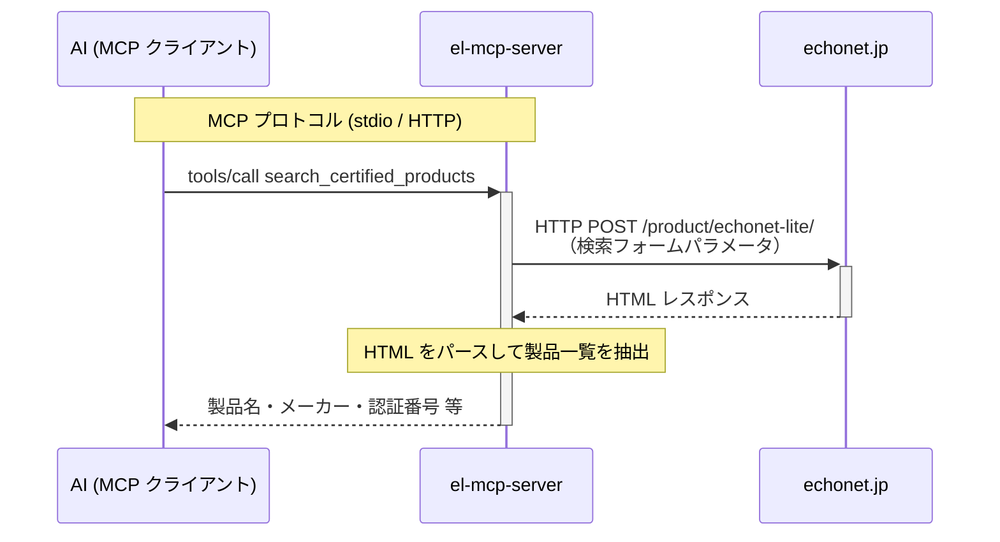

# el-mcp-server

[](https://github.com/thekuwayama/el-mcp-server/actions/workflows/build.yaml)

ECHONET Lite の情報を AI から利用可能にする、読み取り専用の MCP (Model Context Protocol) サーバーです。Go で実装しています。

## 提供する MCP ツール

すべて読み取り専用（`ReadOnlyHint: true`）です。

### 仕様検索（静的データ）

ECHONET Lite Appendix の公式機械可読版 [MRA (Machine Readable Appendix)](https://echonet.jp/spec_mra_rr3/) の JSON データを埋め込んで検索します。

| ツール | 概要 |
|---|---|
| `search_device_class` | 名前・キーワード・EOJ コードで機器クラスを検索 |
| `list_epc` | 機器クラスの EPC（プロパティコード）一覧を取得 |
| `get_epc_detail` | 特定 EPC の詳細（データ型・単位・アクセス規則）を取得 |

収録機器クラス（全 14 クラス）:

- ノードプロファイル (`0EF0XX`)
- 温度センサ (`0011XX`)
- 湿度センサ (`0012XX`)
- CO2 センサ (`001BXX`)
- 家庭用エアコン (`0130XX`)
- 電気温水器 (`026BXX`)
- 住宅用太陽光発電 (`0279XX`)
- 燃料電池 (`027CXX`)
- 蓄電池 (`027DXX`)
- 電気自動車充放電器 (`027EXX`)
- 分電盤メータリング (`0287XX`)
- 低圧スマート電力量メータ (`0288XX`)
- 一般照明 (`0290XX`)
- 電気自動車充電器 (`02A1XX`)

### ECHONET Lite 機器通信（UDP / LAN）

同一 LAN 上の ECHONET Lite 機器と UDP（ポート 3610）で通信します。

| ツール | 概要 |
|---|---|
| `discover_devices` | マルチキャスト（224.0.23.0）で LAN 内の機器を探索 |
| `get_property` | 指定機器の EPC プロパティ値を Get で取得。EPC `8A`（メーカーコード）は `manufacturer_name` フィールドも自動付与 |

### 製品検索（HTTP）

| ツール | 概要 |
|---|---|
| `search_certified_products` | [echonet.jp](https://echonet.jp/product/echonet-lite/) の認証登録製品を検索 |

## アーキテクチャ

3 種のツール群はデータの取得方法が異なります。

### 仕様検索（静的データ）

MRA JSON はビルド時にバイナリへ埋め込まれます。ツール呼び出し時の外部通信はなく、プロセス内で完結します。



### ECHONET Lite 機器通信（UDP / LAN）

ツール呼び出しのたびに同一 LAN 上の機器へ UDP でリアルタイムに問い合わせます（オンデマンド型。事前のデータ蓄積はしません）。



`discover_devices` / `get_property` が通信できるのは、el-mcp-server を起動したマシンが属する LAN 上の機器のみです。Docker のブリッジネットワーク内からはマルチキャストが LAN に届かないため、機器探索を使う場合はホスト上で直接バイナリを実行してください。

同一ホスト上で ECHONET Lite エミュレータと el-mcp-server を併用する場合、両者が UDP ポート 3610 を同時に占有できないため `discover_devices` は使用できません。エミュレータの IP（`127.0.0.1`）と EOJ があらかじめわかっている場合は、`discover_devices` を経由せず直接 `get_property` を呼び出してください。

### 製品検索（HTTP）

ツール呼び出し時に echonet.jp へ HTTP リクエストを送り、レスポンスの HTML をパースして返します。



## ビルド

```bash
go build -o el-mcp-server .
```

## 起動

```bash
# stdio モード（デフォルト）
./el-mcp-server

# HTTP モード（Streamable HTTP）
./el-mcp-server -transport http -addr :8080
```

## Claude Code への登録

```bash
claude mcp add el-mcp-server -- /path/to/el-mcp-server
```

登録後、Claude に「LAN 内の ECHONET Lite 機器を探して」「スマートメーターの EPC 一覧を教えて」のように話しかけると各ツールが呼び出されます。

## データソース

- [ECHONET Lite 規格書 Ver.1.14](https://echonet.jp/spec_v114_lite/) — フレーム構造・UDP 通信仕様
- [MRA (Machine Readable Appendix) v1.4.0](https://echonet.jp/spec_mra_rr3/) — 機器クラス・EPC 定義。Appendix Release R の公式 JSON 版を `echonet/spec/mra/` に収録し、ビルド時に埋め込み
- [ECHONET Lite 認証製品検索](https://echonet.jp/product/echonet-lite/) — `search_certified_products` が実行時に取得
- [メーカーコード一覧](https://echonet.jp/wp/wp-content/uploads/pdf/General/Echonet/ManufacturerCode/list_code.xlsx) — EPC `8A` の解決用。`echonet/spec/manufacturers/codes.json` に収録し、ビルド時に埋め込み。`/update-manufacturer-codes` スキルで更新可能

仕様は [echonet.jp の仕様総合ページ](https://echonet.jp/spec_g/) から辿れます。

## MRA データ更新手順

`echonet/spec/mra/` の JSON を最新の MRA (Machine Readable Appendix) に差し替える手順です。Claude Code スキル `/update-mra`（`.claude/skills/update-mra/SKILL.md`）で対話的に実行することもできます。

1. 最新版の発見: [仕様総合ページ](https://echonet.jp/spec_g/) → 「Appendix ECHONET 機器オブジェクト詳細規定」の MRA ページ (`https://echonet.jp/spec_mra_rrN/`) を辿り、zip URL とバージョン文字列 (例: `MRA_v1.4.0`) を特定する。zip URL・配布ページ URL は版ごとに変わるためハードコードしない。

2. ダウンロードと差し替え: `cmd/update-mra` が VERSION 比較・ダウンロード・展開・コピーをまとめて行います。

   ```shell-session
   $ go run ./cmd/update-mra \
       "https://echonet.jp/wp/wp-content/uploads/pdf/General/Standard/MRA/MRA_vX.Y.Z.zip" \
       MRA_vX.Y.Z
   ```

   `already up to date` が出た場合は差分なしで終了。

3. ビルドと動作確認:

   ```shell-session
   $ go build -o el-mcp-server .
   ```

   HTTP モードで起動し、MCP 経由で `search_device_class` / `list_epc` / `get_epc_detail` が正常に返ることを確認します。起動時に panic する場合は MRA の JSON スキーマが変わっているので、`echonet/spec/load.go` の `mraDevice` / `mraProp` / `mraData` を新スキーマに合わせて修正します。

4. 差分確認とコミット:

   ```shell-session
   $ git diff --stat echonet/spec/mra/
   ```

   EPC の追加・削除・名称変更をサマリしたうえでコミットします。

## 制限事項

- 認証機構を実装していません。[MCP の Authorization 仕様](https://modelcontextprotocol.io/specification/2025-06-18/basic/authorization)では、認証をサポートする場合、HTTP ベーストランスポートの実装は OAuth 2.1 ベースの同仕様に準拠すべき（SHOULD）とされていますが、本サーバーは未対応です。HTTP モードは信頼できるネットワーク内でのみ使用してください
- 読み取り専用です。機器への書き込み（SetC/SetI）は実装していません
- `search_certified_products` の検索パラメータは echonet.jp のフォーム仕様に依存するため、絞り込みが効かない場合があります
