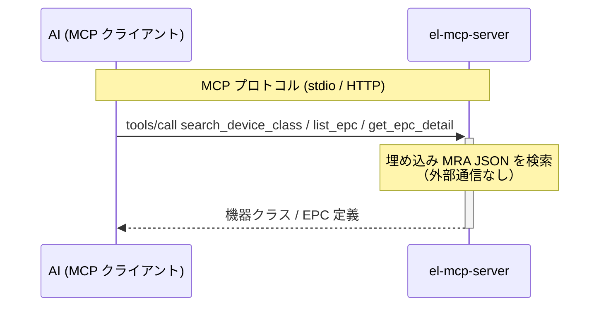
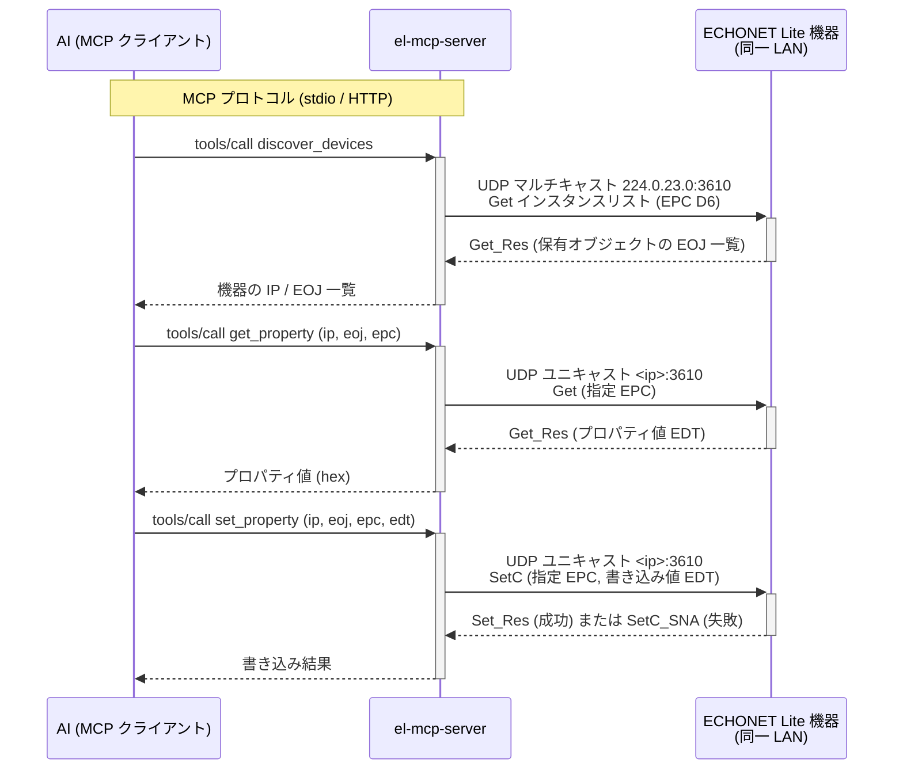
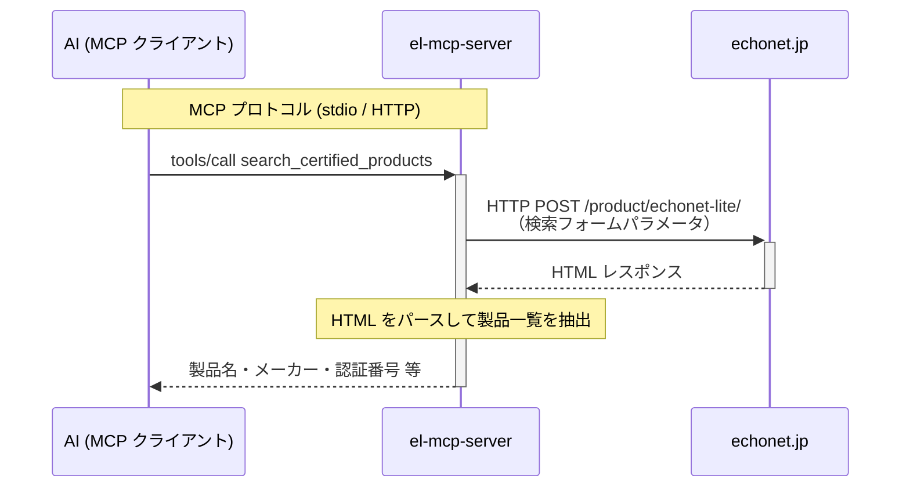
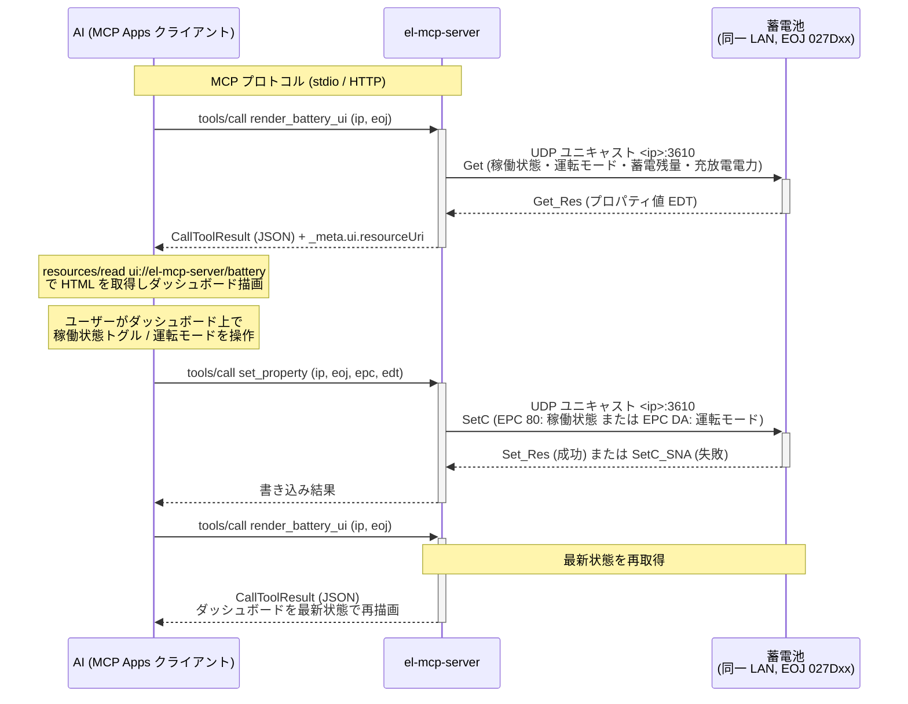

# el-mcp-server

[](https://github.com/thekuwayama/el-mcp-server/actions/workflows/build.yaml)

ECHONET Lite の情報を AI から利用可能にする MCP (Model Context Protocol) サーバーです。Go で実装しています。

## 提供する MCP ツール

4 系統のツール群があります。`set_property` を除くすべてのツールは読み取り専用（`ReadOnlyHint: true`）です:

- **仕様検索** — 埋め込み (`//go:embed`) MRA JSON をプロセス内で検索 (外部通信なし)
- **機器通信** — LAN 上の ECHONET Lite 機器へ UDP で問い合わせ
- **製品検索** — echonet.jp へ HTTP でリクエスト
- **UI 表示** — 機器通信結果を MCP Apps 対応クライアントでダッシュボード表示

### 仕様検索（静的データ）

ECHONET Lite Appendix の公式機械可読版 [MRA (Machine Readable Appendix)](https://echonet.jp/spec_mra_rr3/) の JSON データを埋め込んで検索します。

| ツール | 概要 |
|---|---|
| `search_device_class` | 名前・キーワード・EOJ コードで機器クラスを検索 |
| `list_epc` | 機器クラスの EPC（プロパティコード）一覧を取得 |
| `get_epc_detail` | 特定 EPC の詳細（データ型・単位・アクセス規則）を取得 |

収録機器クラス（全 14 クラス）:

- ノードプロファイル (`0EF0XX`)
- 温度センサ (`0011XX`)
- 湿度センサ (`0012XX`)
- CO2 センサ (`001BXX`)
- 家庭用エアコン (`0130XX`)
- 電気温水器 (`026BXX`)
- 住宅用太陽光発電 (`0279XX`)
- 燃料電池 (`027CXX`)
- 蓄電池 (`027DXX`)
- 電気自動車充放電器 (`027EXX`)
- 分電盤メータリング (`0287XX`)
- 低圧スマート電力量メータ (`0288XX`)
- 一般照明 (`0290XX`)
- 電気自動車充電器 (`02A1XX`)

### ECHONET Lite 機器通信（UDP / LAN）

同一 LAN 上の ECHONET Lite 機器と UDP（ポート 3610）で通信します。

| ツール | 概要 |
|---|---|
| `discover_devices` | マルチキャスト（224.0.23.0）で LAN 内の機器を探索 |
| `get_property` | 指定機器の EPC プロパティ値を Get で取得。EPC `8A`（メーカーコード）は `manufacturer_name` フィールドも自動付与 |
| `set_property` | 指定機器の EPC プロパティ値を SetC（応答あり）で書き込み。**機器の実際の状態を変更します**（`ReadOnlyHint: false` / `DestructiveHint: true`）。書き込み可否・EDT の形式は事前に `get_epc_detail` で確認してください |

### 製品検索（HTTP）

| ツール | 概要 |
|---|---|
| `search_certified_products` | [echonet.jp](https://echonet.jp/product/echonet-lite/) の認証登録製品を検索 |

### UI 表示（MCP Apps）

| ツール | 概要 |
|---|---|
| `render_battery_ui` | 蓄電池(EOJ `027Dxx`)の稼働状態・運転モード・蓄電残量・充放電電力を取得。[MCP Apps](https://modelcontextprotocol.io/community/sep/1865)（SEP-1865）対応クライアントでは `ui://el-mcp-server/battery` リソースをダッシュボード UI として表示。ダッシュボード上の稼働状態トグルと運転モードのセレクトから `set_property` を呼び出して機器を操作可能 |
| `render_solar_ui` | 住宅用太陽光発電(EOJ `0279xx`)の稼働状態・瞬時発電電力・積算発電/売電電力量・系統連系状態・出力抑制状態を取得。MCP Apps 対応クライアントでは `ui://el-mcp-server/solar` リソースをダッシュボード UI として表示。仕様上ほとんどのプロパティが読み取り専用のため、`render_battery_ui` と異なり操作系のコントロールは持たない読み取り専用ダッシュボード |

MCP Apps 未対応のクライアント（Claude Code CLI など）では、通常のツール同様に JSON がそのまま返ります。

## アーキテクチャ

3 種のツール群はデータの取得方法が異なります。

### 仕様検索（静的データ）

MRA JSON はビルド時にバイナリへ埋め込まれます。ツール呼び出し時の外部通信はなく、プロセス内で完結します。


```mermaid
sequenceDiagram
    participant AI as AI (MCP クライアント)
    participant S as el-mcp-server

    Note over AI,S: MCP プロトコル (stdio / HTTP)

    AI->>+S: tools/call search_device_class / list_epc / get_epc_detail
    Note over S: 埋め込み MRA JSON を検索<br/>（外部通信なし）
    S-->>-AI: 機器クラス / EPC 定義
```

### ECHONET Lite 機器通信（UDP / LAN）

ツール呼び出しのたびに同一 LAN 上の機器へ UDP でリアルタイムに問い合わせます（オンデマンド型。事前のデータ蓄積はしません）。


```mermaid
sequenceDiagram
    participant AI as AI (MCP クライアント)
    participant S as el-mcp-server
    participant D as ECHONET Lite 機器<br/>(同一 LAN)

    Note over AI,S: MCP プロトコル (stdio / HTTP)

    AI->>+S: tools/call discover_devices
    S->>+D: UDP マルチキャスト 224.0.23.0:3610<br/>Get インスタンスリスト (EPC D6)
    D-->>-S: Get_Res (保有オブジェクトの EOJ 一覧)
    S-->>-AI: 機器の IP / EOJ 一覧

    AI->>+S: tools/call get_property (ip, eoj, epc)
    S->>+D: UDP ユニキャスト <ip>:3610<br/>Get (指定 EPC)
    D-->>-S: Get_Res (プロパティ値 EDT)
    S-->>-AI: プロパティ値 (hex)

    AI->>+S: tools/call set_property (ip, eoj, epc, edt)
    S->>+D: UDP ユニキャスト <ip>:3610<br/>SetC (指定 EPC, 書き込み値 EDT)
    D-->>-S: Set_Res (成功) または SetC_SNA (失敗)
    S-->>-AI: 書き込み結果
```

`discover_devices` / `get_property` / `set_property` が通信できるのは、el-mcp-server を起動したマシンが属する LAN 上の機器のみです。

同一ホスト上で ECHONET Lite エミュレータと el-mcp-server を併用する場合、両者が UDP ポート 3610 を同時に占有できないため `discover_devices` は使用できません。エミュレータの IP（`127.0.0.1`）と EOJ があらかじめわかっている場合は、`discover_devices` を経由せず直接 `get_property` / `set_property` を呼び出してください。

`set_property` は SetC のみに対応しています（応答を待たずに成否が確認できない SetI は未対応）。EPC が書き込み不可、または EDT の形式が不正な場合、機器は `SetC_SNA` を返し、ツールはエラーとして報告します。

### 製品検索（HTTP）

ツール呼び出し時に echonet.jp へ HTTP リクエストを送り、レスポンスの HTML をパースして返します。


```mermaid
sequenceDiagram
    participant AI as AI (MCP クライアント)
    participant S as el-mcp-server
    participant W as echonet.jp

    Note over AI,S: MCP プロトコル (stdio / HTTP)

    AI->>+S: tools/call search_certified_products
    S->>+W: HTTP POST /product/echonet-lite/<br/>（検索フォームパラメータ）
    W-->>-S: HTML レスポンス
    Note over S: HTML をパースして製品一覧を抽出
    S-->>-AI: 製品名・メーカー・認証番号 等
```

### UI 表示（MCP Apps）

`render_battery_ui` / `render_solar_ui` は内部で ECHONET Lite 機器通信（UDP）を行い、取得結果を通常の `CallToolResult` として返します。MCP Apps 対応クライアントはツール定義の `_meta.ui.resourceUri` を見て、埋め込み (`//go:embed`) 済みの HTML リソースをダッシュボードとして描画します。返す JSON（`structuredContent`）は両ツールで命名規則（snake_case、単位サフィックス `_w` / `_percent` / `_kwh`）を揃えており、対応する HTML（`tools/ui/templates/battery.html` / `solar.html`）も見出し→ゲージ→プロパティ一覧という同じ構造を共有しています。


```mermaid
sequenceDiagram
    participant AI as AI (MCP Apps クライアント)
    participant S as el-mcp-server
    participant D as 蓄電池<br/>(同一 LAN, EOJ 027Dxx)

    Note over AI,S: MCP プロトコル (stdio / HTTP)

    AI->>+S: tools/call render_battery_ui (ip, eoj)
    S->>+D: UDP ユニキャスト <ip>:3610<br/>Get (稼働状態・運転モード・蓄電残量・充放電電力)
    D-->>-S: Get_Res (プロパティ値 EDT)
    S-->>-AI: CallToolResult (JSON) + _meta.ui.resourceUri
    Note over AI: resources/read ui://el-mcp-server/battery<br/>で HTML を取得しダッシュボード描画

    Note over AI: ユーザーがダッシュボード上で<br/>稼働状態トグル / 運転モードを操作
    AI->>+S: tools/call set_property (ip, eoj, epc, edt)
    S->>+D: UDP ユニキャスト <ip>:3610<br/>SetC (EPC 80: 稼働状態 または EPC DA: 運転モード)
    D-->>-S: Set_Res (成功) または SetC_SNA (失敗)
    S-->>-AI: 書き込み結果
    AI->>+S: tools/call render_battery_ui (ip, eoj)
    Note over S,D: 最新状態を再取得
    S-->>-AI: CallToolResult (JSON)<br/>ダッシュボードを最新状態で再描画
```

ダッシュボードの HTML(`tools/ui/templates/battery.html`)は MCP Apps の postMessage ブリッジ経由で `tools/call` をホストに直接送信できるため、稼働状態(EPC `80`)のON/OFFトグルと運転モード(EPC `DA`)のセレクトから、AI を介さず `set_property` → `render_battery_ui`(再取得)を呼び出して画面を更新します。運転モードの選択肢はサーバー側 (`tools/ui/battery_decode.go`) と手動で同期しています。

`render_solar_ui` のダッシュボード(`tools/ui/templates/solar.html`)も上記と同じ postMessage ブリッジ・`ui/initialize` ハンドシェイク・サイズ報告ロジックを使用しますが、住宅用太陽光発電クラスは大半のプロパティが読み取り専用のため `set_property` は呼び出さず、`tools/call render_solar_ui` の結果を表示するだけの読み取り専用ダッシュボードです。積算発電/売電電力量から算出した自家消費率(`self_consumption_percent`)を、蓄電残量ゲージと同じ見た目のゲージで表示します。

## ビルド

```bash
go build -o el-mcp-server .
```

## 起動

```bash
# stdio モード（デフォルト）
./el-mcp-server

# HTTP モード（Streamable HTTP）
./el-mcp-server -transport http -addr :8080
```

## Claude Code への登録

```bash
claude mcp add el-mcp-server -- /path/to/el-mcp-server
```

登録後、Claude に「LAN 内の ECHONET Lite 機器を探して」「スマートメーターの EPC 一覧を教えて」「192.168.1.50 の蓄電池を UI 表示して」「192.168.1.60 の太陽光発電を UI 表示して」「192.168.1.100 のエアコンの運転モードを冷房にして」のように話しかけると各ツールが呼び出されます。

## データソース

- [ECHONET Lite 規格書 Ver.1.14](https://echonet.jp/spec_v114_lite/) — フレーム構造・UDP 通信仕様
- [MRA (Machine Readable Appendix) v1.4.0](https://echonet.jp/spec_mra_rr3/) — 機器クラス・EPC 定義。Appendix Release R の公式 JSON 版を `echonet/spec/mra/` に収録し、ビルド時に埋め込み
- [ECHONET Lite 認証製品検索](https://echonet.jp/product/echonet-lite/) — `search_certified_products` が実行時に取得
- [メーカーコード一覧](https://echonet.jp/wp/wp-content/uploads/pdf/General/Echonet/ManufacturerCode/list_code.xlsx) — EPC `8A` の解決用。`echonet/spec/manufacturers/codes.json` に収録し、ビルド時に埋め込み。`/update-manufacturer-codes` スキルで更新可能

仕様は [echonet.jp の仕様総合ページ](https://echonet.jp/spec_g/) から辿れます。

## MRA データ更新手順

`echonet/spec/mra/` の JSON を最新の MRA (Machine Readable Appendix) に差し替える手順です。Claude Code スキル `/update-mra`（`.claude/skills/update-mra/SKILL.md`）で対話的に実行することもできます。

1. 最新版の発見: [仕様総合ページ](https://echonet.jp/spec_g/) → 「Appendix ECHONET 機器オブジェクト詳細規定」の MRA ページ (`https://echonet.jp/spec_mra_rrN/`) を辿り、zip URL とバージョン文字列 (例: `MRA_v1.4.0`) を特定する。zip URL・配布ページ URL は版ごとに変わるためハードコードしない。

2. ダウンロードと差し替え: `cmd/update-mra` が VERSION 比較・ダウンロード・展開・コピーをまとめて行います。

   ```shell-session
   $ go run ./cmd/update-mra \
       "https://echonet.jp/wp/wp-content/uploads/pdf/General/Standard/MRA/MRA_vX.Y.Z.zip" \
       MRA_vX.Y.Z
   ```

   `already up to date` が出た場合は差分なしで終了。

3. ビルドと動作確認:

   ```shell-session
   $ go build -o el-mcp-server .
   ```

   HTTP モードで起動し、MCP 経由で `search_device_class` / `list_epc` / `get_epc_detail` が正常に返ることを確認します。起動時に panic する場合は MRA の JSON スキーマが変わっているので、`echonet/spec/load.go` の `mraDevice` / `mraProp` / `mraData` を新スキーマに合わせて修正します。

4. 差分確認とコミット:

   ```shell-session
   $ git diff --stat echonet/spec/mra/
   ```

   EPC の追加・削除・名称変更をサマリしたうえでコミットします。

## 制限事項

- 認証機構を実装していません。[MCP の Authorization 仕様](https://modelcontextprotocol.io/specification/2025-06-18/basic/authorization)では、認証をサポートする場合、HTTP ベーストランスポートの実装は OAuth 2.1 ベースの同仕様に準拠すべき（SHOULD）とされていますが、本サーバーは未対応です。HTTP モードは信頼できるネットワーク内でのみ使用してください
- 機器への書き込みは `set_property`（SetC）のみ対応しています。SetI（応答なしの書き込み）は未実装です
- `set_property` は機器の実際の状態（運転モード・温度設定など）を変更します。呼び出し前に対象 EPC が書き込み可能か、EDT が正しい形式かを `get_epc_detail` で確認してください
- `search_certified_products` の検索パラメータは echonet.jp のフォーム仕様に依存するため、絞り込みが効かない場合があります
